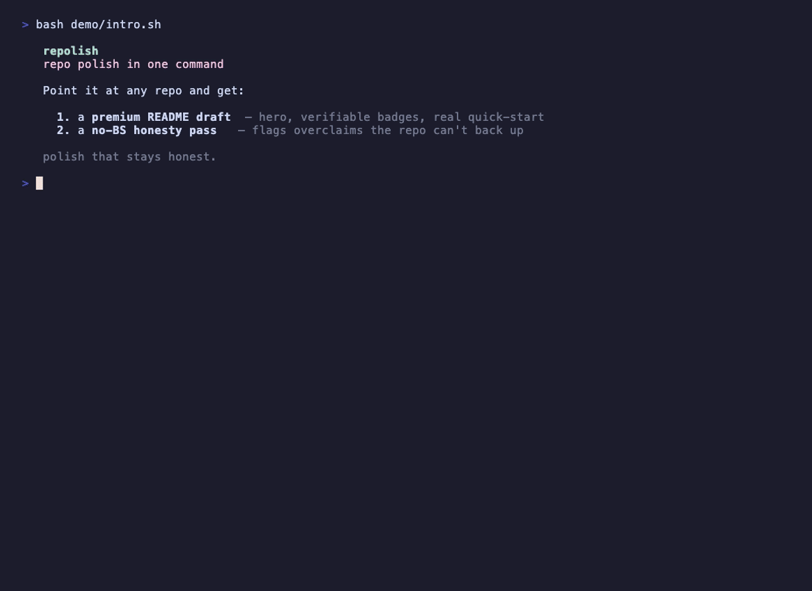

<div align="center">

# repolish

**Make any repo's first impression look premium — and keep it honest.**

[](https://github.com/hamza-ali-shahjahan/repolish/actions/workflows/ci.yml)


*repo polish in one command.*



</div>

## What is repolish?

Point it at a code repo and it drafts a polished README — centered hero, tagline,
*verifiable* badges, an honest comparison table, and a real quick-start derived from
the repo's manifest. Then it runs a **no-BS honesty pass** that flags claims the repo
can't back up — `production-ready` with no tests, `tested on Windows` with no CI,
fabricated benchmarks — so the polish never tips into hype.

It runs fully offline and deterministically: no network, no LLM calls, no accounts.

## Quick start

```bash
# from the repo you want to polish:
bun run /path/to/repolish/bin/repolish.ts .

# or write a draft + honesty report into .repolish/
bun run /path/to/repolish/bin/repolish.ts . --write
```

## What you get

- **A README draft** with the premium structure, where every uncertain field is a
  visible `TODO` instead of an invented claim.
- **An honesty report** — each flagged line with its severity, *why* it was flagged
  against the repo's evidence, and a suggested honest rewrite.
- **`--json`** for piping facts/findings into other tooling.

## How it compares

> Filled only with what's verifiable today. Rows we can't back up are left out.

|  | **repolish** | Typical README generator |
|---|:---:|:---:|
| Generates a structured README | ✅ | ✅ |
| Flags overclaims against repo evidence | ✅ | ❌ |
| Runs offline / no LLM required | ✅ | ❓ |

## Status

Early. v0 generates the README draft and runs the honesty pass; covered by an eval
suite (`bun run eval`). The demo above is a *real* recording (made with
[vhs](https://github.com/charmbracelet/vhs) — see [`demo/repolish.tape`](demo/repolish.tape)),
not a mockup. Teaching repolish to record that GIF for *your* repo automatically is
the next milestone — not done yet.

## License

MIT
